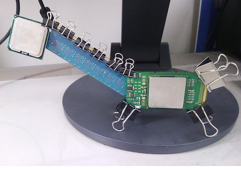
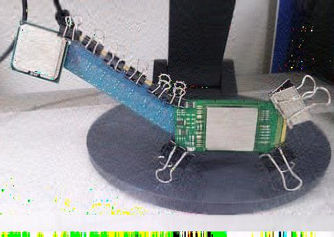
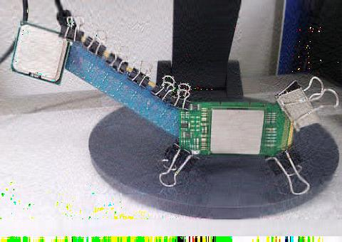

[Japanese](README_ja.md)/ English

# Comparison between HOSVD and HOOI

## Summary

Performs low-rank approximation of a given image. We compare two schemes, the higher order singular value decomposition (HOSVD), and the higher orthogonal iteration of tensors (HOOI).

## Usage

```
$ python hooi_sample.py filename ratio
```

The 1st argument is input file. The 2nd argument determines how many ranks will be used for approximation. Consider a Image with the size of (w,h). Then the width will be truncated to be `int(w*ratio)` and the height to be `int(h*ratio)`.

When the value of ratio is not specified, then 0.2 will be used.

## Example

```
$ python hooi_sample.py uma.jpg  
Ratio = 0.2
Performing HOSVD
0.966415890942
Saved as uma_hosvd.jpg
Performing HOOI
1.29997357769
0.977742274282
0.957462600028
0.953166704329
0.95163785607
0.950901319943
0.950467674764
0.950171911725
0.949946487327
0.949759967973
Saved as uma_hooi.jpg
```

The numbers denotes the residual. Suppose X is the original tensor and XP is the approximated tensor. Then residula r is defined by r = |X - XP|/|X|, where |X| denotes the Frobenius norm of X. The HOOI shows better performance than the HOSVD.

Input image (Original)



Approximated image (HOSVD, ratio = 0.2)



Approximated image (HOOI, ratio = 0.2)


